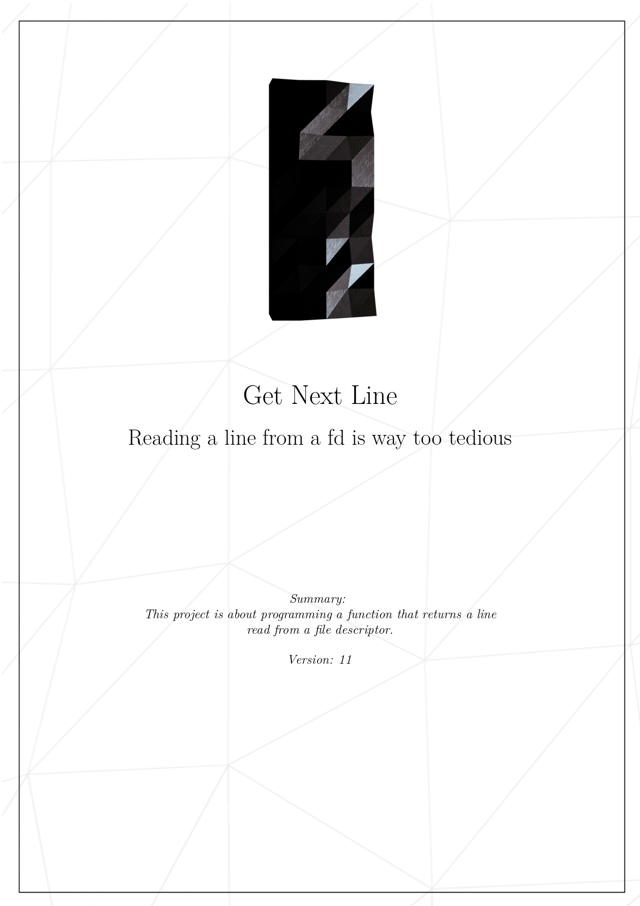
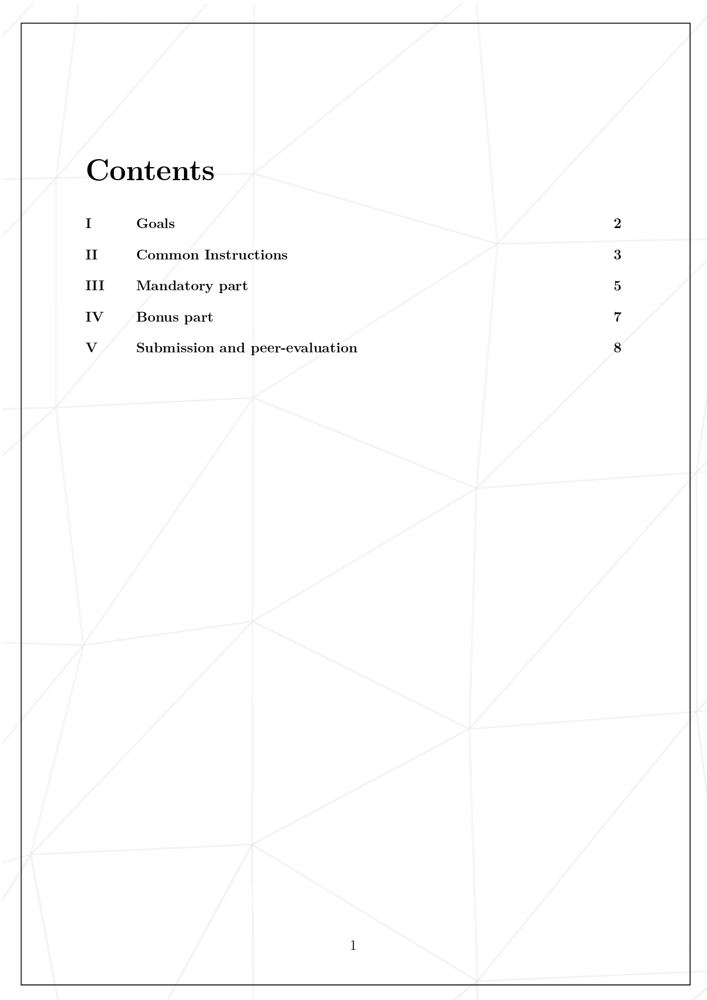
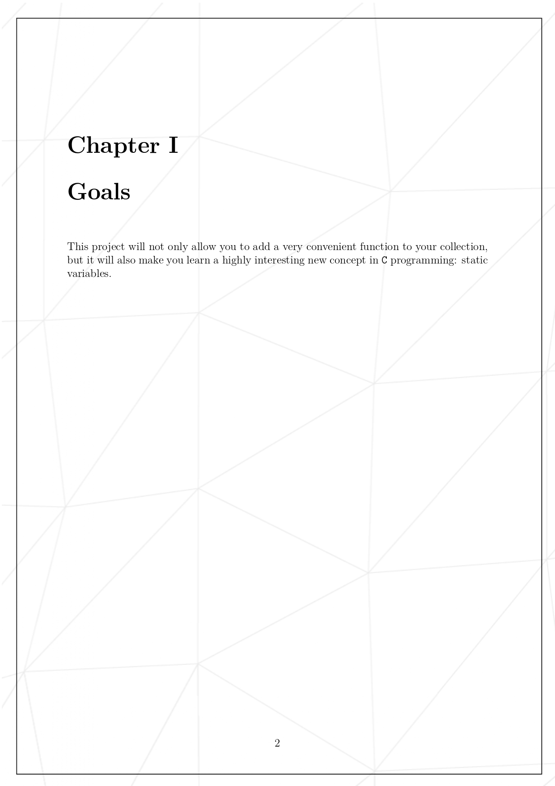
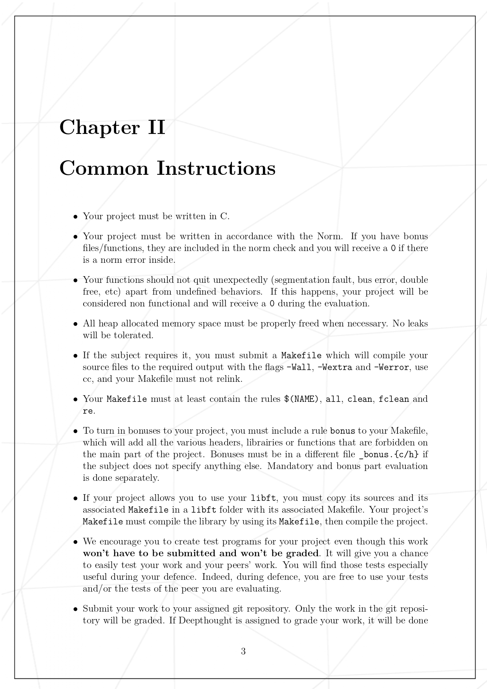
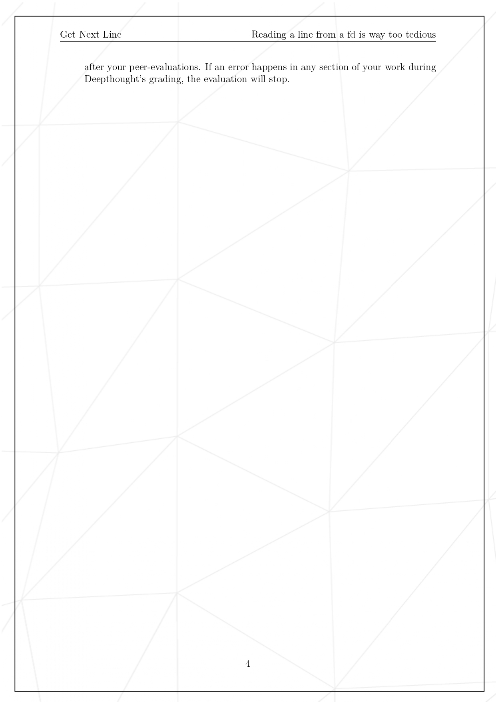
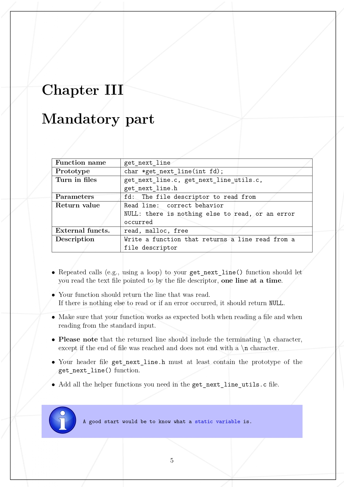
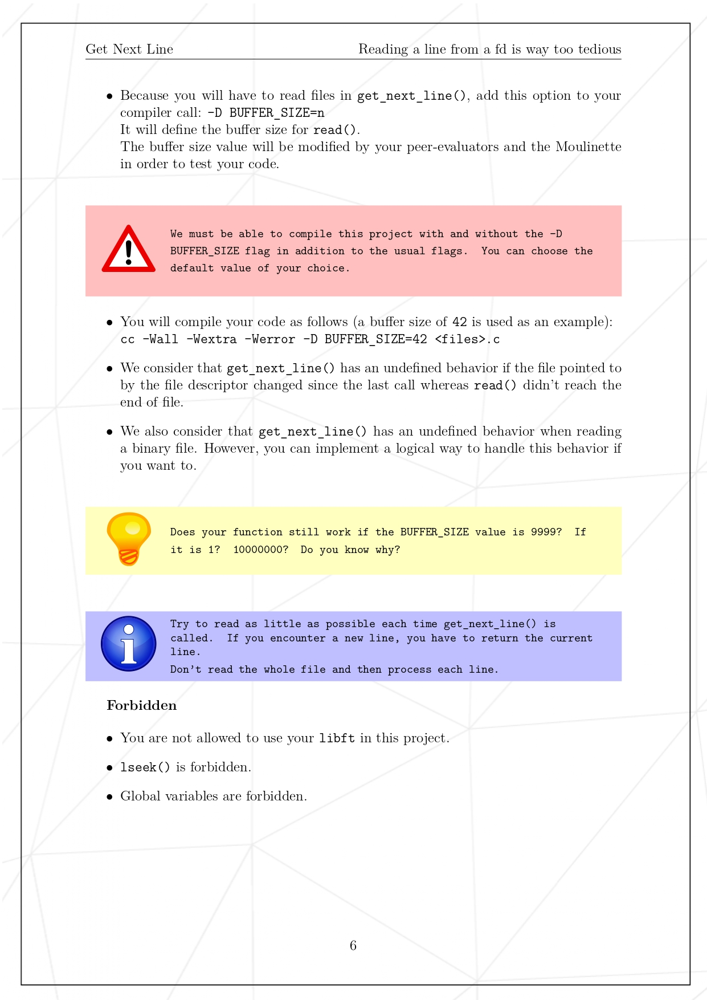
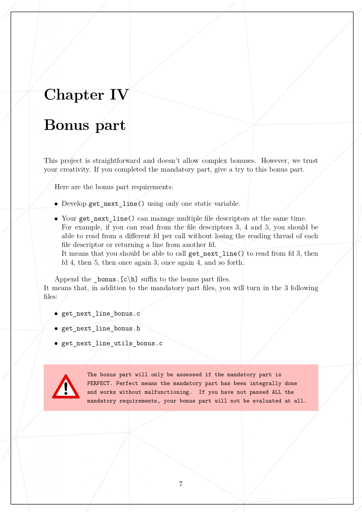
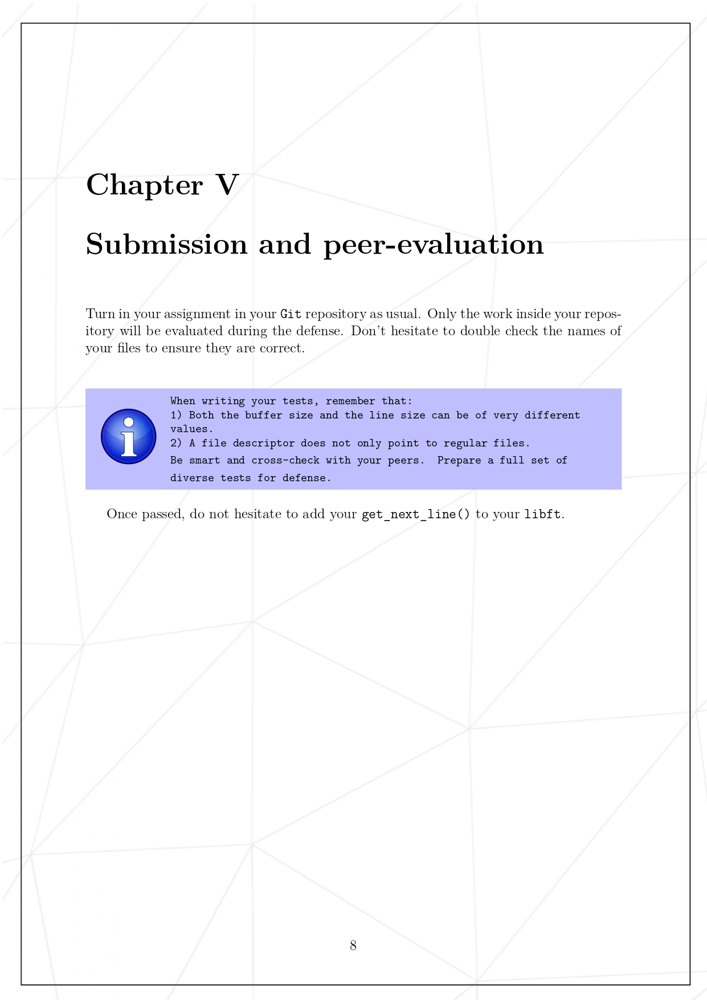

#### Subject











#### Compilation

Without bonus:
```bash
gcc -Wextra -Werror -Wall main.c get_next_line_bonus.c get_next_line_bonus.h get_next_line_utils_bonus.c && ./a.out
```

With bonus:
```bash
gcc -Wextra -Werror -Wall main.c get_next_line.c get_next_line.h get_next_line_utils.c && ./a.out
```
